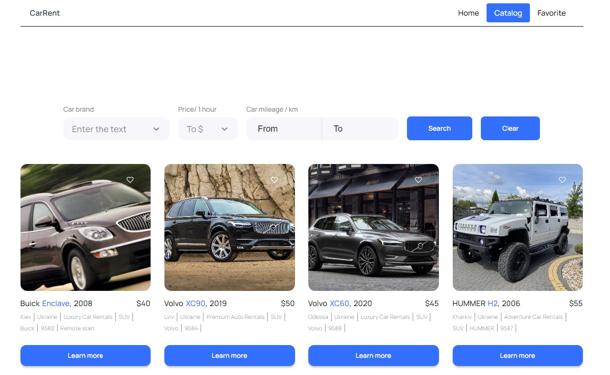

<h1 align="center">CarRent</h1>
<h2 align="center">

## About this project

CarRent is a site that offers:

- searching cars by models, price or milage
- adding cars to the list of favorites

## Technologies and libraries used to create the project:

- This project was created with the help of [Vite + React](https://github.com/vitejs/vite)
- [React Redux](https://react-redux.js.org)
- [Redux Toolkit](https://redux-toolkit.js.org)
- [Redux Persist](https://github.com/rt2zz/redux-persist)
- [React Router Dom](https://reactrouter.com/en/main)
- [Emotion Styled](https://emotion.sh/docs/styled)
- [Axios](https://axios-http.com/ru/docs/intro)
- [React Select](https://react-select.com)
- HTML
- CSS

## Live page

Live page can be accessed via [https://dtripled.github.io/car-rent/](https://dtripled.github.io/car-rent/)

